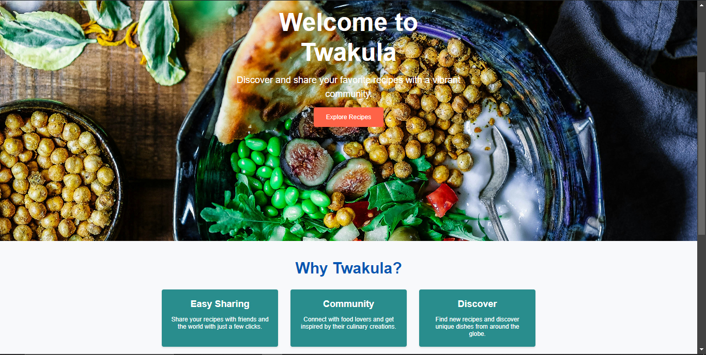

# Twakula - Recipe Sharing Platform

Welcome to Twakula! 🎉 A backend API designed for a recipe sharing platform, where you can share your favorite recipes, rate them, and discover new culinary delights. Think of it as the "Instagram of recipes" for food enthusiasts!



## Table of Contents

1. [Features](#features)
2. [Tech Stack](#tech-stack)
3. [Setup Instructions](#setup-instructions)
4. [API Endpoints](#api-endpoints)
5. [Database Schema](#database-schema)
6. [Third-Party Services](#third-party-services)
7. [Contributing](#contributing)
8. [License](#license)

## Features

- **User Authentication**: Secure user registration and login using JWT.
- **Recipe Sharing**: Create, update, and delete recipes with ease.
- **Recipe Discovery**: Browse and search for a variety of recipes.
- **Ratings and Reviews**: Rate and review recipes to share your feedback.
- **Image Uploads**: Include images in your recipes, stored using AWS S3 or Cloudinary.
- **Robust Data Validation**: Ensures accurate data and provides helpful error messages.

## Tech Stack

- **Backend**: Node.js, Express.js
- **Database**: MongoDB
- **Authentication**: JWT (JSON Web Tokens)
- **Storage**: AWS S3 or Cloudinary (for images)
- **Other Tools**: Mongoose, bcrypt, dotenv

## Setup Instructions

1. **Clone the Repository:**
    ```sh
    git clone https://github.com/khayo254/Twakula_Backend.git
    cd Twakula_Backend
    ```

2. **Install Dependencies:**
    ```sh
    npm install
    ```

3. **Configure Environment Variables:**
   - Create a `.env` file in the root directory and add the following variables:
     ```env
     PORT=3000
     MONGO_URI=mongodb://localhost:27017/twakula
     JWT_SECRET=your_jwt_secret
     CLOUDINARY_CLOUD_NAME=your_cloudinary_cloud_name
     CLOUDINARY_API_KEY=your_cloudinary_api_key
     CLOUDINARY_API_SECRET=your_cloudinary_api_secret
     ```

4. **Run the Server:**
    ```sh
    npm start
    ```

5. **Access API Documentation:**
   - Visit `http://localhost:3000/api-docs` (if using Swagger or similar tool).

## API Endpoints

### **Authentication**
- **Register**: `POST /api/auth/register`
- **Login**: `POST /api/auth/login`

### **Users**
- **Get User Profile**: `GET /api/users/:id`
- **Update User Profile**: `PUT /api/users/:id`

### **Recipes**
- **Create Recipe**: `POST /api/recipes`
- **Get All Recipes**: `GET /api/recipes`
- **Get Recipe by ID**: `GET /api/recipes/:id`
- **Update Recipe**: `PUT /api/recipes/:id`
- **Delete Recipe**: `DELETE /api/recipes/:id`

### **Ratings**
- **Rate a Recipe**: `POST /api/recipes/:id/rate`
- **Get Ratings for a Recipe**: `GET /api/recipes/:id/ratings`